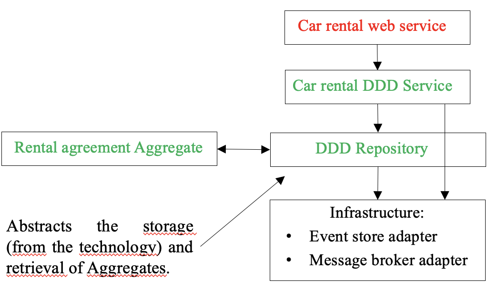
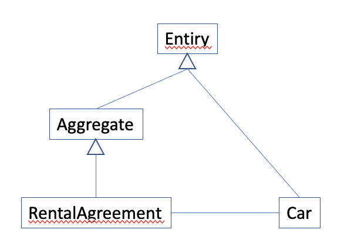
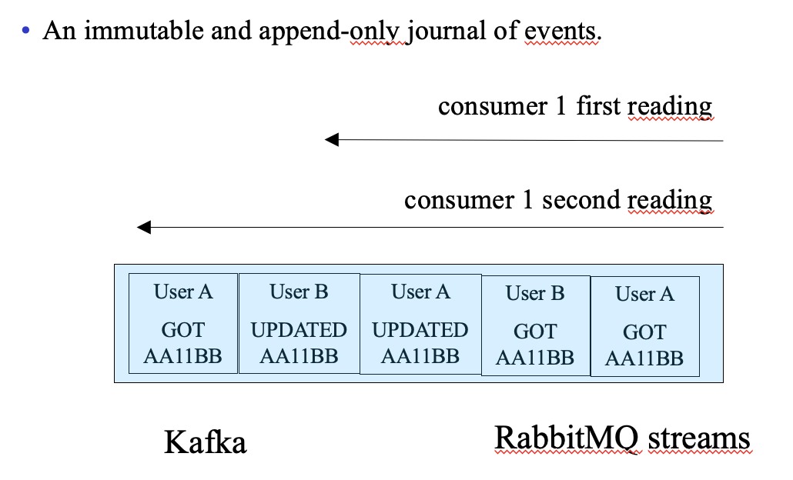
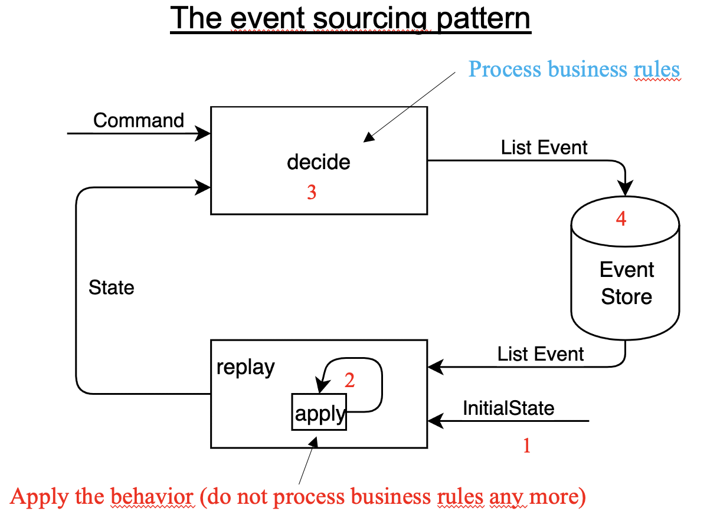
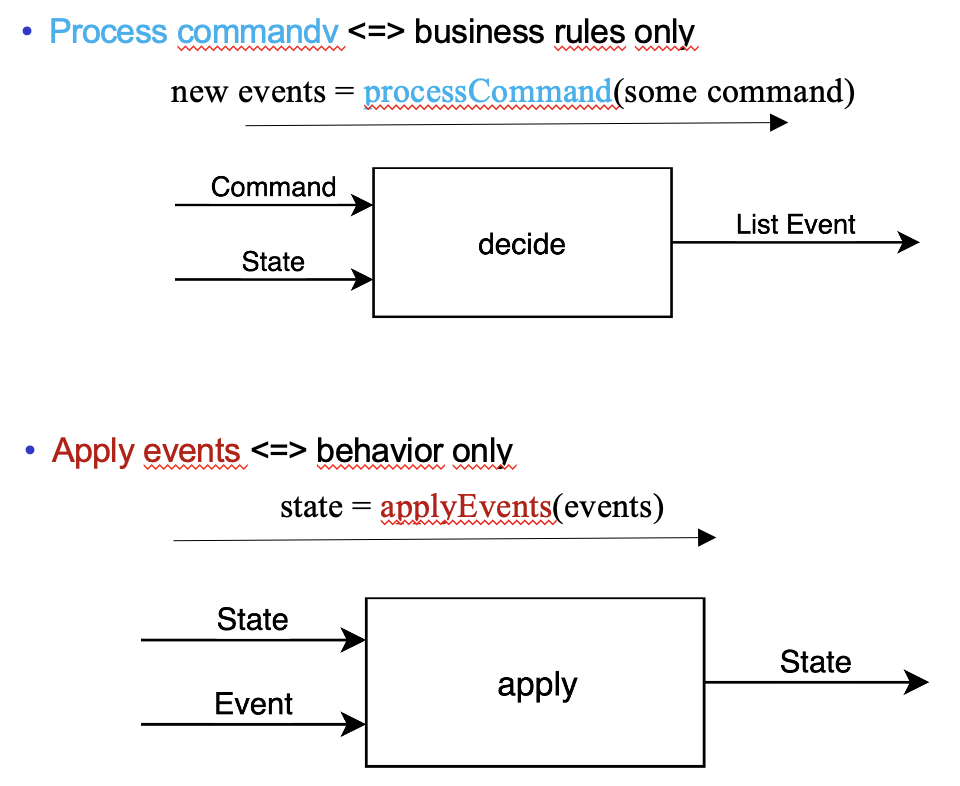

# Domain Driven Design and Event Sourcing

  <ul>
    <li><a href="#domain-driven-design">1. Domain Driven Design</a>

    </li>
  </ul>

## Domain Driven Design

## Rest Web Service
https://github.com/charroux/eventsourcig/blob/main/carservice/src/main/java/com/charroux/carservice/CarRentalController.java

## DDD service
https://github.com/charroux/eventsourcig/blob/main/carservice/src/main/java/com/charroux/carservice/RentalServiceImpl.java

## DDD repository
https://github.com/charroux/eventsourcig/blob/main/eventsourcing/src/main/java/com/charroux/eventsourcing/EntityRepositoryImpl.java

## DDD entities, aggregates

### RentalAgreement
https://github.com/charroux/eventsourcig/blob/main/carservice/src/main/java/com/charroux/carservice/RentalAgreement.java
### Aggregate
https://github.com/charroux/eventsourcig/blob/main/eventsourcing/src/main/java/com/charroux/eventsourcing/Aggregate.java
### Entity
https://github.com/charroux/eventsourcig/blob/main/eventsourcing/src/main/java/com/charroux/eventsourcing/Entity.java
### Car
https://github.com/charroux/eventsourcig/blob/main/carservice/src/main/java/com/charroux/carservice/Car.java

# Message Oriented Middleware with RabbitMQ stream

https://www.rabbitmq.com/streams.html

## Publisher
https://github.com/charroux/eventsourcig/blob/main/stream/src/main/java/com/charroux/stream/EventPublisher.java
## Consumer
https://github.com/charroux/eventsourcig/blob/main/stream/src/main/java/com/charroux/stream/EventConsumer.java

# Event sourcig
## Event sourcing

## The event sourcing pattern

https://github.com/charroux/eventsourcig/blob/main/carservice/src/main/java/com/charroux/carservice/RentalServiceImpl.java

## Apply vs Process

https://github.com/charroux/eventsourcig/blob/main/carservice/src/main/java/com/charroux/carservice/RentalAgreement.java

# How to?

docker run --name mongodb -d -p 27017:27017 mongodb/mongodb-community-server:6.0-ubi8

docker stop mongodb && docker rm mongodb

